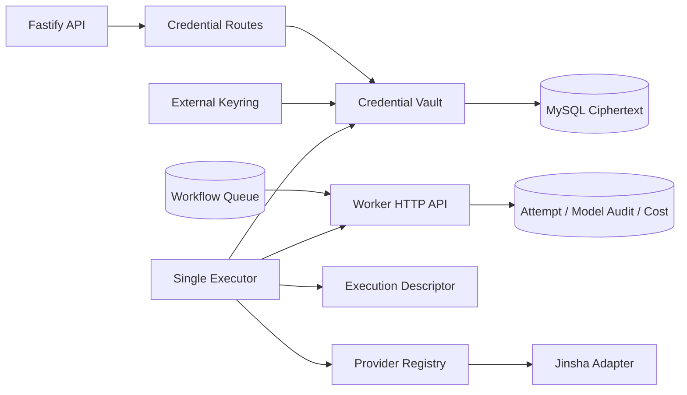

# AI 直聘 Provider Runtime 安全与执行契约

## 当前状态

- 当前分支已实现加密凭据、金沙 OpenAI-compatible adapter、Provider registry、单并发 Worker Executor、限流、预算、重试决策和成本审计。
- `20260805_ai_direct_provider_runtime` 已部署生产；迁移成功只表示表结构就绪，不表示执行能力启用。
- 没有真实金沙凭据 canary，没有生产 keyring、`executor.env` 或 Executor 进程。
- `AI_DIRECT_PROVIDER_RUNTIME_ENABLED=false` 与 `PROVIDER_EXECUTION_ENABLED=false` 是当前生产安全状态。实现和迁移完成不等于 canary 通过，也不等于生产启用。
- 桌面端只可把凭据能力表示为“未启用”或服务器实际返回的状态；不得根据数据库迁移推断 Key 已配置或 Provider 可执行。
- 与桌面 proposed 契约的整体关系见 `specs/ai-direct-desktop-platform-integration.md`。

## 模块职责

- `jobQueue.ts`：拥有 lease、attempt、失败决策、退避、步骤/run 状态、成本累计、审计和 outbox；禁止发起 Provider 网络请求。
- Worker HTTP API：是 Executor 提交 heartbeat、成功和失败的唯一队列写入边界；校验组织 token、worker ID、lease owner 与 lease 时效。
- Executor：一次最多处理一个 Provider 步骤；解析批准后的执行描述，获取短生命周期凭据，执行限流/预算/超时并调用 Provider。
- Provider adapter：只负责外部协议、严格响应解析和稳定错误分类；不读数据库、不决定重试、不计算价格。
- CredentialStore/Vault：只负责密文生命周期与受控明文作用域；不得承担工作流状态。

## 凭据与密钥边界

- 数据库只保存 AES-256-GCM 密文、nonce/tag、凭据内容版本、加密 key 版本、验证状态和 HMAC fingerprint。
- 仓库外 keyring 包含独立 fingerprint key 和多版本 32-byte encryption key；两类 key 禁止复用。
- AAD 绑定 credential ID、owner user、Provider、credential content version 与 encryption key version，禁止跨行替换密文。
- API key 替换只递增 credential content version；master-key rewrap 只改变 encryption key version。
- 明文只允许存在于 `CredentialLease.withSecret` 回调；不得进入数据库明文字段、队列 payload、日志、异常、审计、测试 fixture 或文档。
- keyring 目录权限必须为 `700`，文件权限必须为 `600`；加载时拒绝 symlink、非普通文件、错误 owner、非规范 key 和权限过宽。
- 轮换默认 dry-run，每次锁定并重加密一行；密文与审计在同一事务提交。复核所有行完成前不得删除旧 key。

## 执行描述与调度

- 只有 `metadata.providerExecution.kind = "provider"` 的步骤可被 Provider capability Worker 领取。
- execution descriptor 必须从当前有效 lease、已发布 agent version、批准的 model catalog、请求者有效凭据和不可变步骤 metadata 解析。
- descriptor 不包含明文凭据，只包含 Provider/model 映射、credential ID/version、输入、timeout、预算、pricing 快照和 rate limit。
- Provider Executor 不得领取普通生命周期步骤。每个步骤完成后 run 返回 `queued`，下一步骤必须重新按 capability 领取，禁止沿用同一 lease 直接激活下一步骤。
- 初始生产拓扑固定 `instances: 1`、并发 1、数据库连接上限 1。多实例前必须将内存 token bucket 替换为共享限流器。
- heartbeat 间隔不得超过 30 秒；lease 丢失、heartbeat 失败、SIGTERM 或步骤 timeout 必须中止当前 Provider 请求。

## 限流、预算与成本

- 限流键为 `providerKey + providerModelKey`，同时预留 RPM 与估算 TPM。
- 执行前使用批准的 catalog pricing 与 `estimatedInputTokens + maxOutputTokens` 做预算预检。
- Provider 响应中的价格不可信；实际成本只按 catalog pricing 快照和返回的 input/output token 计算。
- `costMicros` 使用整数微单位并向上取整。实际成本超过步骤预算、数值超出安全范围或缺少有效 pricing 时不得报告成功。
- complete/fail 事务必须同时处理 attempt、step/run、token/cost 汇总、模型审计、业务审计和 outbox。
- `(runId, stepId, attempt)` 模型审计必须幂等；重复回报不得重复计费。
- 审计允许保存 Provider request ID、模型映射、credential version、token、cost、latency 与脱敏 routing metadata；禁止保存 Authorization、密钥、完整请求正文或完整模型响应。

## 失败分类与重试

- 可重试：`timeout`、`network`、`provider_5xx`、`rate_limit`；使用有上限的指数退避和抖动，并尊重有界 `Retry-After`。
- 默认终止：`auth`、`quota`、`invalid_request`、`model_unavailable`、`protocol`、`budget_exceeded`。
- 达到 `maxAttempts` 后所有失败都终止。
- `auth` 失败可将对应凭据标记为 invalid，但不得自动删除凭据。
- 重试决策属于 queue/service 层；Provider adapter 和 Executor 不得自行重试外部请求。

## 金沙协议约束

- 仅实现 OpenAI-compatible `GET /v1/models` 与 `POST /v1/chat/completions`。
- Base URL 只能来自仓库外环境配置，必须是无凭据、path、query、fragment 的 HTTPS origin；禁止请求级覆盖和 HTTP redirect。
- 使用内置 `fetch`，限制 timeout 与响应字节数，严格校验 `choices`、`usage`、model ID 和 request ID。
- 除已观察到的 OpenAI Chat Completions 兼容行为外，不推测金沙私有协议。

## 上线门禁

1. 串行通过定向单测、TypeScript、临时 MySQL 全迁移链与 Worker runtime 测试。
2. 使用本机短生命周期 mock HTTP 验证 Worker API、401/429/5xx/timeout/malformed response 和金沙 chat 边界。
3. 使用窄权限、低成本真实凭据执行一次严格 model/request/token/budget 限制的 canary；核对 usage、cost、审计幂等与日志脱敏。
4. canary 通过后才创建受限生产备份、部署加法迁移 `20260805`、配置仓库外 keyring/provider/executor 环境并启动一个 Executor。
5. 部署不得重启前端 `iclawstore`。异常时先关闭 `PROVIDER_EXECUTION_ENABLED` 并停止 Executor，不回退已经提交的业务数据。