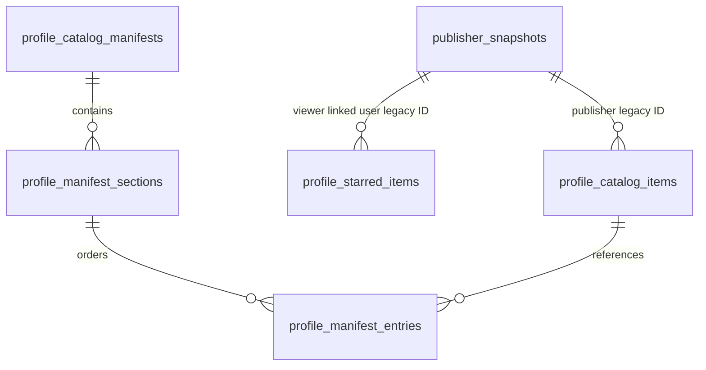

# 用户资料页下游投影评审包

> **状态**：`implementing`。已提交 projection expand schema、独立 DTO/decoder、四类 internal Convex snapshot source、页级事务同步、reconciliation checkpoint/report/runner 与 shadow Fastify route；仍未发布本领域 candidate release、未应用任何本领域 migration、未运行 candidate 同步、实际 reconciliation 或 compare，读权威没有变化。
>
> **当前不可运行**：candidate release 不包含本领域的 Prisma migrations 或受保护 process，且 candidate 环境未配置执行开关、run-to-completion 与 approval ref。`20260830_profile_projection_source_href` 是尚未应用的 expand-only migration；它保存 source snapshot 的 canonical `href`，避免 catalog Package 与 starred Skill 在严格对账时无法无歧义还原。不得单独先应用该 migration，也不得启用 compare、MySQL 读取或读切换。
>
> **本批次代码证据**：`profileProjectionDecoder` 把已由 Convex source 规范化的 catalog snapshot 转为独立 DTO，固定 canonical downloads/stars、可空字段、GitHub source 边界以及 `downloads` / `recent` 的稳定排序。`profileProjectionMigration` 的 published Skill/Package、starred 与 GitHub manifest snapshot 均以带 phase 的 cursor fail-closed 分页；manifest 保留 source 状态、commit、`notGrouped` 以及 section/entry 原始顺序，且仅接纳公开 Publisher 所属 source。`profileProjectionSyncOrchestrator` 以页为事务边界，原子写入 projection、legacy map、outbox 与 batch cursor；source hash 重放只刷新 batch marker。缺失 Profile/Publisher map 或 manifest 跨 Publisher 引用会抛错并回滚整页。starred 直接通过 `stars.by_user_createdAt` 遍历收藏记录，保留 source `createdAt`，并独立验证收藏者、Skill 及 Skill owner Publisher 的公开性，绝不将被收藏 Skill 绑定到收藏者的 Publisher。`profileProjectionReconciliationTargetRepository` 已完成 source-page 同 identity target 还原；target-only orphan、关系不变量、显式 approval 分类、candidate-only reconciliation process 和 manifest MySQL display 的代码边界均已补齐。它们均未获得 candidate release、migration 应用、真实执行或 compare 授权，不能据此产生候选就绪或读切换结论。任何 orphan 在没有独立 approval ref 和允许的分类前保持 `unclassified`，继续阻断 `candidateReady`。
>
> **权威边界**：Profile 与 Publisher 身份继续由其既有 port 管理；Skill、Package、收藏和 GitHub source 仍由 Convex 写权威。该领域仅产生供公开资料页读取的可重建投影，绝不回填 Profile/Publisher snapshot，也不承接发布、收藏、GitHub 配置或审核写入。

## 1. 当前调用链与迁出目标

`/user/:handle` 已通过 Fastify loader 读取 Publisher core 与公开成员；但页面仍在浏览器中直接调用以下 Convex 查询：

| 页面能力 | 当前 Convex 查询 | 直接 source facts | 目标投影 |
| --- | --- | --- | --- |
| 已发布 Skill / Plugin | `publishers.listPublishedPage` | `publishers`、`skills`、`packages`、official 状态及统计字段 | `profile_catalog_items` |
| 收藏的 Skill | `publishers.listStarredPage` | `stars`、`skills`、Skill owner Publisher、official 状态及统计字段 | `profile_starred_items` |
| GitHub 展示分组 | `publishers.getPublishedDisplayManifest` | `githubSkillSources.displayManifest*` 加已发布 Skill 投影 | `profile_catalog_manifests` |

迁出后页面只能通过 Fastify 读取三个 endpoint；`compare` 期间仍返回 Convex 当前权威数据，`mysql_authoritative` 必须 fail-closed。公开列表不使用 reactive subscription；候选实现须使用 HTTP one-shot fetch 与明确 cursor，不能重建 `useQuery` / `usePaginatedQuery` 的订阅模型。

## 2. 非目标与禁止项

- 不迁移 Skill/Version/制品 identity、slug alias、安装资格、制品内容、Package/release、发布 token、上传 ticket 或扫描事实。
- 不迁移 `stars` 写入、取消收藏、评论、举报、审核、授权与审计链。
- 不复制 GitHub 仓库内容或改变 GitHub 同步 worker；展示 manifest 只作为已验证 source 的只读输入。
- 不将 published/starred 数量或卡片明细写回 `profile_snapshots`、`publisher_snapshots`，也不将任何前序领域的 fixture retention 扩展到本领域。

## 3. 提议的目标模型（待单独 ERD 审批）

| 目标记录 | 关键 identity / 约束 | 必须保存的投影事实 |
| --- | --- | --- |
| `profile_catalog_items` | `(publisherLegacyConvexId, itemLegacyConvexId)` 唯一；`legacyConvexId -> targetId` 不可复用 | kind、slug、displayName、summary、icon、canonical `sourceHref`、owner handle、official、canonical stats、更新时间、可见/删除状态、source GitHub 标识 |
| `profile_starred_items` | `(viewerUserLegacyConvexId, skillLegacyConvexId)` 唯一 | 收藏时间、同一份公开 Skill digest 与 canonical `sourceHref`、目标 owner、可见性决策输入；不得复制私有收藏 |
| `profile_catalog_manifests` | source GitHub legacy ID + verified commit/hash 唯一 | repo、`ok/missing/invalid/failed` 状态、manifest hash/commit、`notGrouped`、更新时间 |
| `profile_manifest_sections` / `entries` | section 顺序与 item 顺序均稳定；entry 只能引用同 Publisher 的公开 Skill | title、description、manifest skill key、解析后的 item legacy ID；无匹配项不是伪造条目 |

所有表必须通过本领域的 `migration_legacy_id_maps`、batch、outbox 与 reconciliation records 接入共享 migration port。manifest section 与 entry 必须携带 `publisherId`，并通过复合外键同时约束 manifest、section 和 catalog item 的 Publisher identity；不得只依赖同步代码检查跨 Publisher 引用。具体 SQL、FK、索引、保留期和物理表名必须在下一次实现评审中批准；本节不是 schema 授权。

## 4. 同步、资产与状态规则

- source decoder 只读取公开资料页所需字段，按稳定 `(updatedAt, legacyConvexId)` watermark + overlap 增量页运行；Skill、Package、star 与 GitHub source 更新都必须能使受影响 Publisher 投影重算。公开 Publisher 可见性（含个人 Publisher 的 legacy owner 回退）已抽为共享 Convex helper；公开 query 与内部 migration source 必须共同调用它，禁止复制该规则。
- published Skill 与 Package 的内部 source 分别使用 `skills.by_active_updated`、`packages.by_active_updated` 分页；starred source 使用新增的 `stars.by_user_createdAt` 索引按收藏记录分页；manifest source 使用 `githubSkillSources.by_updated` 分页。四者的 cursor 都携带并校验 `phase`，无效或跨 phase cursor 必须 fail-closed。manifest 保留 source status、commit、`notGrouped` 及 section/entry 原始顺序，source owner 不公开时整条 source 排除。starred 输出保留 `createdAt` 作为 `starredAt`，并独立解析每个 Skill 的公开 owner；它不根据收藏者的 Publisher 推导或过滤被收藏 Skill。Skill source 的 canonical stats 复用 `readCanonicalStat`，禁止复制双字段 stat 规则。同步侧已通过窄 Convex query capability 调用四个 internal query，不能持有通用 Convex client。
- 每页在单一 MySQL transaction 内写 projection、legacy map、cursor、差异证据和 outbox；重复页重放不得新增卡片、收藏或 manifest entry。
- 公开图片仍引用已受管的站内 URL；本领域不复制二进制。若后续卡片需要新 asset，必须先走 `ManagedAssetStore` 的 MIME、bytes、SHA-256、ACL、软删除与回收流程。
- `displayManifestStatus !== ok`、manifest 无匹配、Skill soft-deleted、owner 不公开或 source 失效时必须按当前 Convex 可见性排除；不得以缓存旧条目替代拒绝/隐藏语义。

## 5. 规范化对账与 candidate gate

对账输入必须按 Publisher handle 规范化，并覆盖：

1. published 的 Skill/Plugin 集合、kind、顺序、cursor、href、owner、official、summary/icon、`readCanonicalStat` 产出的 downloads/stars、更新时间和隐藏状态；
2. personal Publisher 的 starred 集合、star 时间排序与 downloads/recent 二次排序、删除 Skill 与不可见 owner 的排除；org 必须返回空收藏页；
3. GitHub source repo、manifest status/hash/commit、section/entry 顺序、`notGrouped` 位置，以及无效/缺失 manifest 返回 `null` 的语义；
4. source/target orphan、跨 Publisher entry、legacy ID 冲突、重复收藏、游标恢复、软删除与权限拒绝；
5. Fastify JSON 的 DTO、404 与空页响应。任何 `unclassifiedDifferences > 0` 阻断切换。

candidate fixture 至少包含：个人与 org Publisher、Skill 和 Plugin、多个收藏且包含已删除 Skill、官方与非官方 owner、GitHub manifest 的有效/无效/缺失三态、manifest 未匹配条目、重命名/软删除、增量窗口内更新及分页边界。fixture 必须独立于历史 Profile/Publisher retention。

## 6. Fastify 兼容契约与候选网络回归

拟新增的只读端点（路径和 DTO 在实现评审时冻结）：

- `GET /api/publishers/:handle/catalog?kind=skill|plugin&sort=downloads|recent&cursor=&numItems=`
- `GET /api/publishers/:handle/starred?sort=downloads|recent&cursor=&numItems=`
- `GET /api/publishers/:handle/catalog-display?kind=skill&sort=downloads|recent`

要求：输入上限、cursor 非法处理、404、空集合、隐藏对象和 Fastify 错误体均与当前公开行为等价。浏览器先由 Fastify client 消费，后移除 `/user/:handle` 的 `convex/react` 与 generated API import。

candidate gate 必须覆盖 HTTP、SSR 与 Chromium/Mobile Chrome；导航前阻断所有到候选 Convex 的 HTTP/WebSocket 请求。测试应验证上述三个 endpoint、tab 切换、load-more、manifest 分组、404/空页与缓存失效。WebKit 缺宿主运行库时记录为环境阻塞，不可通过放宽网络阻断绕过。

## 7. 指标、回滚与独立评审条件

观察指标：source watermark lag、cursor age、重放率、outbox 成功/失败、投影行数、manifest 状态分布、Fastify 404/5xx、compare mismatch、未分类差异和任何浏览器 Convex 网络请求。

切换前必须：增量同步稳定、资产约束满足、`unclassifiedDifferences=0`、compare 观察期无新差异、候选阻断回归通过、回滚到 Convex 主读已演练。独立评审批准前，保持 `convex_authoritative`；不得因为 Publisher 的已批准旧 org retention 为本领域建立 waiver。