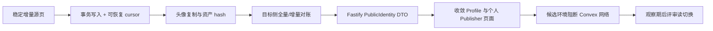

# Profile 与头像迁移交接

> **状态**：Profile/头像候选基础设施、历史 alias source feed、MySQL alias 同步/对账和隔离 fixture 契约已在代码中实现。此前候选 Profile 全量 backfill、头像源确认和 reconciliation 已通过，但新增 alias 代码尚未部署到候选 Convex/站点，也尚未用非空历史 alias fixture 重新执行同步与对账。生产仍是 `convex_authoritative`。
>
> **生产禁止项**：不得运行生产回填/同步、启用 `PROFILE_READ_MODE=mysql_authoritative`、切换生产路由、删除 Convex SDK/functions/Storage/Nginx `/convex` 代理，或将候选环境配置应用到生产。
>
> **候选环境定位**：实际候选环境文件不在仓库内，固定保存于服务器受限路径 `/etc/iclawstore-candidate.env`，权限应为 `0600`、owner 应为 `root:root`。该文件对应候选站点 `https://candidate.iclawstore.com`、候选数据库 `iclawstore_candidate` 和隔离资产目录 `/www/iclawstore-candidate/assets`。不要在仓库复制、提交或重建其中的真实密钥。
>
> **候选配置检查**：运行迁移前必须以 root 读取并脱敏检查该文件；`PROFILE_MIGRATION_ENV=candidate`、`PROFILE_MIGRATION_EXECUTION=1`、非空 `PROFILE_MIGRATION_APPROVAL_REF` 和 Profile Convex admin key 必须同时存在。`DATABASE_URL` 的数据库名必须是 `iclawstore_candidate`。`CONVEX_URL` 必须指向候选 Convex；当前文件若仍为 `https://zhipin.store/convex`，视为生产地址配置错误，禁止运行 preflight 或任何迁移入口。
>
## 当前事实

| 范围             | 候选代码事实                                                                                                                                                                                                                                            | 尚未完成的运行证据                                                                             |
| ---------------- | ------------------------------------------------------------------------------------------------------------------------------------------------------------------------------------------------------------------------------------------------------- | ---------------------------------------------------------------------------------------------- |
| 读 port          | `server/src/domains/profiles/` 保留 `convex/compare/mysql/mysql_authoritative` 状态机；`mysql_authoritative` fail-closed，不允许 Convex fallback。                                                                                                      | 默认和生产配置仍为 Convex 主读，未批准 MySQL 权威切换。                                        |
| 快照导入         | `server/src/profileBackfillProcess.ts` 通过通用 migration port，在同一 MySQL transaction 内写 Profile snapshot、batch/cursor、legacy ID map、当前 slug/handle alias 和头像 outbox；固定 watermark 增量页、终态 batch、重试 map 修复已有目标测试。       | 候选全量 backfill 已完成；最新幂等批次 `7d6f3c1e-7c8f-4b0e-9f65-202608171842` 为 `completed`，`unchangedCount=27`、`errorCount=0`。持续增量同步和生产迁移仍未启用。 |
| 通用迁移底座     | `server/src/domains/migration/migrationPort.ts` 支持事务 connection 重绑定、batch 终态、cursor、legacy map、outbox 和 reconciliation 持久化。Profile 不再以专用 cursor/map 表作为新同步控制面。                                                         | 其他领域尚未接入；旧 Profile 专用表只保留历史兼容，不能据此宣称通用退出完成。                  |
| Schema 与 preflight | `prisma/schema.prisma` 已与三份 expand-only SQL 的 Profile、通用 migration、managed asset、索引和 FK 名称对齐；`db:profiles:preflight` 只读检查表/列/FK 形态、运行批次、头像积压和未解决差异，并区分结构就绪与候选就绪。 | 候选 schema 已应用；最近 preflight 为 `ready=true`、`candidateReady=true`，无运行批次、头像积压、失败资产或未解决/未分类差异。生产模式仍要求独立生产批准位。 |
| 运行入口         | `db:profiles:backfill`、`runtime:profiles:avatar-consumer`、`runtime:profiles:reconciliation` 统一复用授权与结构 preflight；Convex 内部迁移查询要求独立 admin key。头像与对账支持 `once/loop`、有界批次/并发或分页、结构化日志和 SIGINT/SIGTERM 收尾，模块导入不会启动进程。 | 候选 backfill 和 reconciliation 已执行并完成；当前 fixture 无头像源，因此未启动头像 consumer。持续增量同步、候选回归和读切换仍未完成。 |
| 头像资产         | 独立 `profileAvatarAssetConsumer` 使用 claim/lease token、幂等 importer、retry/backoff 和 failure code；完成或失败都先用 `status='processing' AND claimToken=?` 取得回写权，过期 worker 不能覆盖被新 worker 接管的快照。二进制经受控 Convex source reader 校验 MIME/bytes 后写入 `ManagedAssetStore`，成功后 Profile snapshot 才引用 `/api/profile-assets/:assetId/content`。已删除 snapshot 不能由旧事件重新激活。 | 当前 27 条候选 Profile 的头像快照均为 `not_applicable`，pending/failed 均为 0；尚未复制真实 Convex Storage 对象，也未形成头像 bytes/SHA-256、ACL 或删除回收报告。 |
| 对账             | `profileReconciliationProcess` 使用 `listProfileIncrementalPageInternal` 固化 checkpoint 中的 `users.updated_at:<windowStart>` 范围和 source watermark；每页先完成 Profile、alias、个人 Publisher 与头像元数据比较，再于同一个 MySQL transaction 中写差异、source ID 审计证据、checkpoint cursor/count，并同步 migration progress。最终页仅标记 source exhausted；独立完成事务依据持久化 source ID 记录 target-only 孤儿差异后才完成 checkpoint。恢复时不会重读已 exhaust 的 source 页；失败会在 checkpoint 与 migration batch 留下 failure code。报告按该批次真实未解决 `unclassified` 数量 fail-closed。 | 候选批次 `b7404f27-23e9-4efa-b40f-d7442aaa3a98` 已完成：source/target/compared 均为 27，差异和未分类差异均为 0，source ID 证据 27 条，checkpoint 完成且保存 source watermark `1786994404794`；`sourceCursor=null`、`failedAt=null`、`failureCode=null`。历史 alias 另经只读门禁审计确认无非空样本；持续增量同步和故障注入恢复证明仍未完成。 |
| `/profile/:slug` | `src/routes/profile/$slug.tsx` 只通过 `src/lib/publicProfileApi.ts` 请求 Fastify `GET /api/profiles/:slug`；MySQL adapter 支持当前 slug/handle 与 Profile alias，公开头像不返回 Convex URL。                                                            | 显式候选 URL 的 HTTP/SSR/浏览器阻断回归尚未执行；生产仍可由 Fastify adapter 读取 Convex 权威。 |
| `/user/:handle`  | Publisher core profile 与成员已通过 Fastify `GET /api/publishers/:handle`、`/members` 提供；个人与组织 DTO 不得伪造为 Profile。                                                                                                                                                                                                                                          | 发布目录、收藏与 GitHub display manifest 仍由 Convex 查询；必须先建立其 MySQL 行级 projection、增量同步与对账，再新增 Fastify 分页端点并移除页面 `convex/react` hooks。                           |
| 可观察性         | `/health/runtime` 聚合 Profile 读取的 `mysqlHit/fallback/diff/adapterError`，以及同步 watermark/cursor、资产 pending/failed/retry、未分类差异和最近失败码；端点只读。                                                                                   | 未建立候选/生产时序样本、阈值、告警或观察期。                                                  |


## Candidate Prisma migration checkpoint (2026-03-14)

- Candidate `iclawstore_candidate` now has all 39 Prisma migrations applied and reports an up-to-date schema. `prisma validate`, `prisma generate`, and `prisma migrate status` passed.
- The migration was expand-only and did not change Profile/Publisher read mode, routes, or write authority. Production remains `convex_authoritative`.
- Candidate execution encountered and recovered from MySQL 3072-byte index failures in Skill/Package migrations using Prisma rollback resolution and replay-safe table creation. The resulting prefix indexes must be reconciled with Prisma's full-field uniqueness declarations before production migration; this is an explicit production blocker.
- This checkpoint does not change the Profile reconciliation gate. The 27 unclassified alias records still require record-by-record source/target evidence; no lifecycle classification, target repair, closure, or read cutover is authorized by the database migration.


- candidate vhost 现将 `/api/get_config_hashes`、`/api/v1/`、`/api/deploy2/` 与 `/api/function` 精确代理到候选 Convex backend；该边界只作用于 candidate，通用 Fastify `/api/` 与 production 均未改变。
- 旧静态 Profile fixture 清理需要候选开关与确认短语；只允许固定 legacy handle、fixture marker 及固定 legacy member ID。即使父 Publisher 已被先前清理，孤儿 member 也仅在该固定标识命中且父记录不存在时删除；不得把它泛化为历史数据清理或 retention。
- Publisher candidate gate 的最终 reconciliation/preflight 已通过，但 Profile 仍须按本文件既有 alias、写授权、故障恢复与观察期门禁推进；两域均未获生产读切换批准。


本节只记录候选环境证据，不代表生产已启用或已完成 Profile 读切换。

1. 候选服务排查发现 `/www/server/nginx/conf/vhost/candidate.iclawstore.com.conf` 缺少 `/convex/` location；候选 Convex Docker backend 实际健康并监听 `127.0.0.1:3210`。
2. 已在候选 vhost 增加 `/convex/` 到 `http://127.0.0.1:3210/` 的代理，并通过 `nginx -t` 后 reload。修复前候选 Convex 请求为 `502`/超时，修复后查询入口可返回 Convex 后端的正常 `400 BadJsonBody` 参数错误。
3. 已执行候选全量 backfill，批次 `7d6f3c1e-7c8f-4b0e-9f65-202608171842` 状态为 `completed`，`upsertedCount=0`、`unchangedCount=27`、`errorCount=0`。
4. backfill 后只读 preflight 结果为 `ready=true`、`candidateReady=true`、`runningBatchIds=[]`、`pendingAssets=0`、`failedAssets=0`、`unresolvedDifferences=0`、`unclassifiedDifferences=0`。
5. 本次没有修改生产 Nginx、生产数据库或生产 Convex 配置，也没有执行头像 consumer、候选读写回归、观察期或 `mysql_authoritative` 切换。
6. 已通过候选 Convex 内部查询 `profileMigration:listProfileSnapshotPageInternal` 只读核验：源端共 27 条 Profile，分页 `done=true`、`cursor=null`，其中 `imageStorageId` 非空数量为 `0`。因此当前证据为 `candidate profile avatar source count = 0`，`avatar consumer not required for current fixture`；候选 MySQL 的 `not_applicable=27` 与源端结果一致。
7. 已再次执行候选 Profile reconciliation，使用未复用的独立批次 `b7404f27-23e9-4efa-b40f-d7442aaa3a98`：`status=completed`、`sourceProfiles=27`、`targetProfiles=27`、`comparedProfiles=27`、`differenceCount=0`、`unclassifiedDifferenceCount=0`、`candidateReady=true`。checkpoint 为一页完成，`sourceRange=users.updated_at:0`、`sourceWatermark=1786994404794`、`sourceCursor=null`、`sourceCount=27`、`comparedCount=27`、`differenceCount=0`，`sourceExhaustedAt` 和 `completedAt` 均已持久化，`failedAt=null`、`failureCode=null`；对应 source ID 审计证据为 27 条，未解决 reconciliation 记录为 0 条。
8. 本次对账覆盖 Profile 字段、canonical slug/handle、删除/停用/purge、封禁状态、个人 Publisher 关联、目标侧孤儿、头像状态和 source watermark/checkpoint。运行时 alias 比较仍以源端当前 canonical slug/handle 为输入；候选 MySQL 历史 alias 只读门禁审计结果为：alias 总数 27、active 27、active canonical 27、active historical 0、retired 0、孤儿 0；27 个 `user_handle` canonical 映射均存在且无重复。因此当前 fixture 的历史 alias 计数和映射无差异，但没有历史 alias 非空样本，不能据此宣称运行时已验证历史 alias 变更/跳转行为。

## 候选 fixture 最终核验（2026-08-18）

本节仅记录 `r20260314a` 候选 fixture 与候选 MySQL 的证据；它不表示生产同步、生产对账、生产读切换或生产授权迁移已经完成。

- 当前世代 Profile `candidate-e2e-profile-r20260314a` 与 Official org `candidate-e2e-org-r20260314a` 的头像快照均为 `active`，`failureCode=null`。两个受管资产均为 `image/png`、68 bytes、SHA-256 `431ced6916a2a21a156e38701afe55bbd7f88969fbbfc56d7fe099d47f265460`；公开 DTO 只返回站内 `/api/profile-assets/:assetId/content` 或 `/api/publisher-assets/:assetId/content`。
- 当前世代没有 pending 或 failed 头像。全局队列中仍分别存在一条旧静态 fixture `candidate-e2e-profile` / `candidate-e2e-org` 的 pending 记录，失败码分别为 `profile_avatar_source_missing` / `publisher_avatar_source_missing`。其 Convex Storage 已依照精确 fixture marker 清理；对应 MySQL snapshots、outbox 与失败证据必须保留，禁止删除、改写为成功，或用新的候选 Storage 伪造迁移来源。
- Profile reconciliation 批次 `66a829ef-0be2-4652-8a5b-f4c2bbfcc6c7`：source 28、target 29、compared 28、difference/unclassified 各 1，`candidateReady=false`。该 target-only 差异来自保留的旧静态 fixture snapshot，不能通过删除 snapshot 或伪造 Convex source 消除。
- 候选 HTTP regression 在显式 candidate URL 与 `r20260314a` fixture 值下为 6/6 通过，覆盖 canonical/alias、受管头像、Profile/Publisher 404、Official org、owner/member 与分页契约。
- 候选 SSR 的 Profile 头像改为原生 `` 直接消费 Fastify DTO 的受管 asset URL，避免 Radix `AvatarImage` 在候选浏览器中错误回退。构建必须使用隔离 `NITRO_BUILD_DIR` / `NITRO_OUTPUT_DIR`，仅复制产物到 `/www/iclawstore-candidate/releases/candidate-next/.nitro/vite/` 与 `.output/` 后重启 `iclawstore-candidate-ssr`；不得构建或写入生产 release。
- Playwright Chromium 与 Mobile Chrome 的 Candidate Convex-block gate 各 2/2 通过，确认 Profile/Publisher SSR 渲染、头像与零浏览器 Convex HTTP/WebSocket。WebKit 二进制可下载，但宿主缺少运行库；不得为此修改主机级依赖，故 Mobile Safari 仍是环境阻塞项。

## 历史 fixture 保留证据（仅候选）

- 候选 MySQL 已应用 `20260827_candidate_fixture_retention`，并只登记了 `candidate-e2e-profile` 与 `candidate-e2e-org` 两条旧静态 fixture。登记要求候选开关、确认短语 `candidate-e2e-fixtures`、精确 snapshot 标识和原有 `*_avatar_source_missing` outbox 证据；它不会新增通用 waiver，也不会改写 snapshot、asset、outbox 或差异记录。
- Profile reconciliation 批次 `06fad246-2de5-4965-b581-efd5d6048728` 为 source 28、target 29、difference 1，其中 `expected_retired_fixture=1`、`unclassified=0`。该批次的 `candidateReady=true` 只说明此批次的 target-only 历史 fixture 已被精确解释，不代表全局迁移完成。
- 全局 Profile preflight 仍为 `candidateReady=false`：当前 pending/failed asset 均为 0，历史 retained pending 为 1；另有 27 条非 fixture alias `unclassified` 差异继续阻断。不得用 retention 覆盖它们。

## 证据后的下一步

严格按以下顺序推进，不得跳过门禁；当前不得设置 `PROFILE_READ_MODE=mysql_authoritative`，也不得把候选配置复制到生产。

1. **补齐 Profile 历史 alias 源模型与隔离 fixture**：先确认 Convex 是否存在 alias/history 表；若不存在，建立受控事件或历史变更记录作为 source alias feed，并扩展迁移查询与对账输入。候选 fixture 必须覆盖 canonical handle、canonical slug、历史 handle、历史 slug、删除、停用、封禁、purge、个人 Publisher 关联、有头像和无头像 Profile。当前候选仅有 27 个 `user_handle` canonical alias、Profile slug 为 0、历史 alias 为 0，不能将零样本审计当作历史 alias 验收。
2. **执行候选公开读回归**：验证 canonical slug、当前 handle、历史 alias 解析/跳转、未知 alias 404、删除/停用/purge 拒绝状态、头像 URL/MIME/ACL/cache headers、SSR 与 HTTP API 等价性，以及浏览器访问期间 Convex HTTP/WebSocket 阻断。
3. **执行候选写入与身份验证**：验证用户只能更新自己的 Profile、跨用户授权隔离、handle/slug 冲突、rename 后旧 alias 保留、删除/停用/封禁/purge 状态转换、个人 Publisher 关联保护，以及 MySQL projection 延迟或失败时的恢复。
4. **执行 checkpoint 故障注入与回滚演练**：验证分页中断恢复、completed batch 不可重开、重复页重放无重复 alias/资产、差异不会错误标记为已解决、回滚到 Convex 主读可恢复，以及 `mysql_authoritative` 下 MySQL 故障 fail-closed。
5. **候选读切换评审**：只有上述门禁全部通过后，才允许在 `/etc/iclawstore-candidate.env` 设置 `PROFILE_READ_MODE=mysql_authoritative`，只 reload 候选应用并执行完整 smoke；随后记录错误率、延迟、404 比例、差异、checkpoint 和回滚证据，建立观察期。
6. **生产切换评审**：观察期通过、生产 Profile 全量/增量对账、生产回滚验证、监控阈值和独立生产批准全部具备后，才评估生产读切换。生产当前仍为 `convex_authoritative`。


### 公开可见性

- 源端 `toPublicUser` 只因 `deletedAt` 或 `deactivatedAt` 隐藏 Profile。`banReason` 是必须同步和对账的事实，但单独存在时不得被 MySQL adapter 擅自转换为额外公开过滤。
- `purgedAt`、源端不存在而目标仍可解析、slug/handle 冲突、个人 Publisher 关联不一致均是阻断差异。
- Profile 与 Publisher 不可直接互换。个人 Publisher 可以解析到关联用户；组织 Publisher 有成员、目录、统计和角色语义，必须使用独立 DTO 扩展，不能伪装成 Profile。

### 已有代码落点

| 职责                         | 文件                                                |
| ---------------------------- | --------------------------------------------------- |
| Profile port 类型            | `server/src/domains/profiles/publicProfilePort.ts`  |
| 模式与 fallback 边界         | `server/src/domains/profiles/profilePortFactory.ts` |
| Convex/MySQL/compare adapter | `server/src/domains/profiles/`                      |
| Fastify Profile 路由         | `server/src/routes/publicProfiles.ts`               |
| 现有 Profile 回填            | `server/src/profileBackfillProcess.ts`              |
| Profile 迁移只读 preflight   | `server/src/profileMigrationPreflightProcess.ts`    |
| 头像 consumer 进程           | `server/src/profileAvatarAssetConsumerProcess.ts`   |
| Profile 对账进程             | `server/src/profileReconciliationProcess.ts`        |
| 通用迁移 port                | `server/src/domains/migration/migrationPort.ts`     |
| 资产存储边界                 | `server/src/services/managedAssetStore.ts`          |
| `/profile/:slug` HTTP client | `src/lib/publicProfileApi.ts`                       |
| Profile 页面                 | `src/routes/profile/$slug.tsx`                      |
| Publisher 页面               | `src/routes/user/$handle.tsx`                       |
| 候选 HTTP smoke 基础         | `e2e/prod-http-smoke.e2e.test.ts`                   |
| 公共浏览 Playwright 基础     | `e2e/public-routes-smoke.pw.test.ts`                |

## 后续运行与验收顺序



1. **持续同步**：在隔离候选环境运行现有稳定 `(sourceUpdatedAt, legacyConvexId)` cursor、启动高水位和重叠增量窗口，证明全量期间更新不会遗漏。若真实源行为不满足现有查询契约，先修复只读 change-log/版本字段，不得用不稳定分页切读。
2. **事务与恢复**：同一 MySQL transaction 内写 Profile、legacy map、资产待处理事件和 cursor。失败后重放相同页面必须无副作用；completed batch 不得被重新打开。记录 retry、cursor age、watermark lag 与失败码。
3. **头像资产**：通过 source-reader 读取 Convex Storage，写入 ManagedAssetStore；保存 legacy storage ID、owner/ACL、MIME、bytes、SHA-256、复制状态与删除时间。公开 DTO 只能给站内 asset URL/ID。
4. **对账**：比较记录/状态分组、legacy ID、字段 hash、个人 Publisher 关系、slug/handle 当前及历史解析、源缺失 tombstone、资产对象/bytes/SHA-256、外键孤儿和公开 DTO。未分类差异为零才可继续。
5. **公共 DTO**：本切片的 `PublicIdentityPort` 只解析 Profile 当前 slug/handle 与已持久化 Profile alias，返回 `subjectKind: 'profile'`。个人 Publisher alias 和组织 Publisher 目录/成员/统计归下一领域，不从 Profile 源快照推断或伪造。
6. **页面边界**：`/profile/:slug` 已删除客户端 Convex fallback，只调用 Fastify HTTP 契约。`/user/:handle`、`/u/:handle`、`/p/:handle` 与 `/orgs/:handle` 不在本切片内，仍需 Publisher 领域收敛。
7. **候选回归**：仅对显式非生产候选设置 `CLAWHUB_CANDIDATE_E2E=1`、canonical Profile slug 和不同的历史 alias。候选 fixture 必须已有 managed avatar；HTTP 测试验证 DTO/alias/avatar/404，浏览器测试在导航前阻断并记录 Convex HTTP/WebSocket。

## 必须覆盖的测试

- 同步：cursor 边界、全量期间更新、watermark overlap、页级事务失败、重复执行、终态 batch、tombstone、rename/冲突。
- 资产：MIME/ACL、复制失败重试、重复复制、删除回收、byte/SHA-256 mismatch。
- DTO：profile slug、user handle、历史 Profile alias、未知、删除、停用、封禁、旧 slug/handle；不得泄露 Storage path、源 URL或内部迁移状态。个人/组织 Publisher 契约留给下一领域。
- 候选：公开 HTML/DTO JSON、头像与 OG 资产成功状态及 MIME/cache/`nosniff`；不存在/删除/停用/受限资产/未认证/无权限的 401/403/404/410/423 不能被代理改写为 200。
- 静态：已收敛的页面不得重新导入 `convex/react`、`convexHttp` 或 generated API。

## 已验证命令与限制

在仓库根目录或指定 cwd 使用以下可执行入口：

```bash
cd /www/wwwroot/iclawstore.com/server && bun test \
  test/profileMigrationPreflight.test.ts \
  test/profileMigrationProcesses.test.ts \
  test/profileBackfillProcess.test.ts \
  test/profileAvatarAssetConsumer.test.ts \
  test/profileAssetReconciliation.test.ts \
  test/profileReconciliationReportRepository.test.ts \
  test/convexProfileAvatarSourceReader.test.ts \
  test/profileMigrationObservability.test.ts \
  test/publicProfileAdapters.test.ts \
  test/publicProfileRoutes.test.ts \
  src/domains/migration/migrationPort.test.ts
cd /www/wwwroot/iclawstore.com/server && bun node_modules/typescript/bin/tsc -p tsconfig.json --noEmit
cd /www/wwwroot/iclawstore.com && bun node_modules/typescript/bin/tsc -p tsconfig.json --noEmit
cd /www/wwwroot/iclawstore.com && bun node_modules/prisma/build/index.js validate --schema prisma/schema.prisma
cd /www/wwwroot/iclawstore.com && bun scripts/check-no-new-convex-client-usage.ts
cd /www/wwwroot/iclawstore.com && bun node_modules/vitest/vitest.mjs run \
  -c vitest.e2e.config.ts e2e/helpers/candidateConvexNetwork.e2e.test.ts
```

上述 migration/Profile 目标集当前为 53 tests passed，Prisma schema、server/root TypeScript、Convex 依赖基线与 `git diff --check` 均通过；候选网络守卫此前为 5 tests passed。真实候选回归必须由隔离环境显式提供 fixture 后运行；未提供时不得退化为生产地址或随意选择现有用户。当前候选站点固定为 `https://candidate.iclawstore.com`：

```bash
CLAWHUB_CANDIDATE_E2E=1 \
CLAWHUB_CANDIDATE_SITE=https://candidate.iclawstore.com \
PLAYWRIGHT_BASE_URL=https://candidate.iclawstore.com \
CLAWHUB_CANDIDATE_PROFILE_SLUG=<canonical-profile-slug> \
CLAWHUB_CANDIDATE_PROFILE_ALIAS=<historical-profile-alias> \
bun run test:e2e:candidate-http

CLAWHUB_CANDIDATE_E2E=1 \
CLAWHUB_CANDIDATE_SITE=https://candidate.iclawstore.com \
PLAYWRIGHT_BASE_URL=https://candidate.iclawstore.com \
CLAWHUB_CANDIDATE_PROFILE_SLUG=<canonical-profile-slug> \
CLAWHUB_CANDIDATE_PROFILE_ALIAS=<historical-profile-alias> \
bun run test:pw:candidate-convex-block
```

候选服务器的实际环境文件固定为 `/etc/iclawstore-candidate.env`，权限为 `0600`。由于该文件包含 root-only secrets，必须由可读取该文件的受限运行身份加载；不要把它复制到仓库或通过命令行参数重写密钥：

```bash
sudo bash -lc '
  set -a
  . /etc/iclawstore-candidate.env
  set +a
  cd /www/wwwroot/iclawstore.com/server
  exec bun run db:profiles:preflight
'
```

在隔离环境中，所有 Profile 运行入口都 fail-closed，并要求显式审批门禁。preflight 前应脱敏确认 `DATABASE_URL` 的数据库名为 `iclawstore_candidate`、`PROFILE_MIGRATION_ENV=candidate`、`PROFILE_MIGRATION_EXECUTION=1`、审批引用非空、`MANAGED_ASSET_ROOT=/www/iclawstore-candidate/assets`，以及 `CONVEX_URL` 指向候选 Convex。`CONVEX_URL=https://zhipin.store/convex` 是生产地址，出现时必须停止，不得运行 preflight。Convex snapshot/avatar 内部查询必须使用专用迁移 admin key；不得把浏览器 token 或普通用户 token 代替它。

增量 runner 还需显式选择模式和窗口；它会在连续页之间等待以避免对高订阅源表产生连续压力：

```bash
sudo bash -lc '
  set -a
  . /etc/iclawstore-candidate.env
  set +a
  export PROFILE_SYNC_MODE=incremental
  export PROFILE_INCREMENTAL_UPDATED_AFTER=<last-successful-watermark-ms>
  export PROFILE_INCREMENTAL_OVERLAP_MS=300000
  export PROFILE_INCREMENTAL_DELAY_MS=100
  cd /www/wwwroot/iclawstore.com/server
  exec bun run db:profiles:backfill
'
```

头像与对账进程还必须设置 `PROFILE_PROCESS_MODE=once|loop`。生产环境或 `NODE_ENV=production` 额外要求 `PROFILE_MIGRATION_PRODUCTION_APPROVED=1`；仅设置普通执行位不能启动生产任务。

不得在冻结生产执行上述命令，也不得把 `PROFILE_BACKFILL_BATCH_ID` 重用于已完成批次。

- `node_modules/.bin/vite`、`vitest` 和 `server/node_modules/.bin/tsc` 在当前机器可能没有执行权限；使用上面的 `bun <实际脚本路径>` 形式。
- `bunx convex codegen` must never use the retired `https://www.iclawstore.com/convex` host. The public/browser configuration remains `CONVEX_SELF_HOSTED_URL=https://zhipin.store/convex`; however, the current Nginx public prefix does not proxy Convex CLI management paths such as `/api/get_config_hashes`. Until that proxy contract is extended and verified, run codegen only from the server with `CONVEX_SELF_HOSTED_URL=http://127.0.0.1:3210 bunx convex codegen`. CLI generation reports an `Uploading functions to Convex` preparation step, so it is a production-management operation requiring freeze/release approval; successful generation never authorizes deployment or a Profile read cutover.
- 候选构建只能设置隔离的 `NITRO_OUTPUT_DIR`。`.output` 是线上 release symlink，禁止清理、构建到或修改。
- 发布仍冻结；外部认证的 GitHub callback/allowed origins/issuer/audience 和部署变量尚需指向 `https://zhipin.store`。GitHub signin 500、回跳旧域或旧域 TLS 不匹配未解决前，不得恢复生产发布。

## 读切换门槛

以下全部成立前，禁止启用 `PROFILE_READ_MODE=mysql_authoritative`：

1. 持久 cursor + watermark 的连续同步已在隔离环境证明可恢复；
2. 删除、停用、封禁、purge、slug/handle、个人 Publisher 关系及头像 bytes/SHA-256 目标侧对账零未分类差异；
3. Fastify DTO 与 Convex 主读的规范化响应等价，且所有已承诺页面不再直接读取 Convex；
4. 阻断 Convex DNS/网络的候选环境公开读、资产读、拒绝路径、SSR 和浏览器回归通过；
5. 可观察性覆盖同步 lag、失败、资产队列、差异，并完成约定观察期；
6. Profile 仍只有一个写权威。读切换前后都不得新增双写。

相关总账本见 [`convex-exit-domain-ledger.md`](convex-exit-domain-ledger.md)，整体退出约束见 [`convex-exit-migration.md`](convex-exit-migration.md)。
